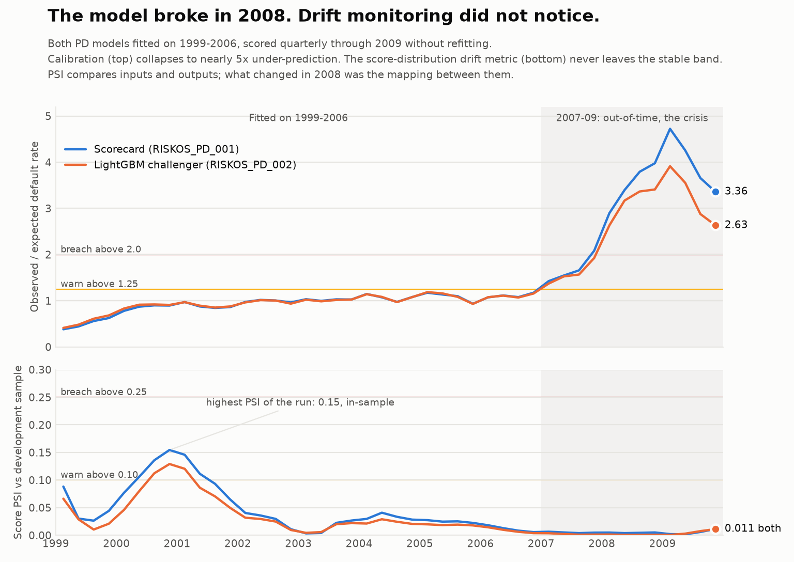

# RiskOS

### Credit risk modelling under stress

An end-to-end mortgage-risk study using [**950,000 loans and 57 million loan-months**](reports/validation_report.md#3-data-target-and-experimental-design)
from the Freddie Mac sample. I built a logistic scorecard and LightGBM challenger,
tested them through the financial crisis, and examined whether monitoring would
have caught their failure.

**Main result:** both models retain useful ranking power, but predict far fewer
defaults than occur. Score-distribution drift stays below warning during the crisis.

[Five-minute walkthrough](docs/demo.md) · [Code and design](#design-decisions-you-can-inspect) · [Run locally](#run-locally) · [Technical reference](docs/README.md)



*Shading marks the 2007–09 crisis. The top panel compares observed with expected
defaults; the bottom measures changes in score distributions. Default outcomes
become observable 12 months after each observation, so the top panel is retrospective.*

## What the experiment found

| Model · 2007–09 crisis | AUC (higher is better) | Predicted default rate | Observed default rate | Observed / expected (ideal: 1) |
| --- | ---: | ---: | ---: | ---: |
| Logistic scorecard | 0.819 | 0.68% | 2.17% | 3.21× |
| LightGBM challenger | 0.832 | 0.78% | 2.17% | 2.80× |

AUC measures ranking. Observed / expected measures whether predicted totals match
outcomes. LightGBM improves both measures, but **neither model estimates crisis
default levels adequately**. Low score drift does not establish accurate probabilities.

[Source CSV](reports/figures/champion_challenger_metrics.csv): uncalibrated models,
`oot_stress` rows. These whole-period ratios differ from the quarterly peaks above.
The [selection memo](reports/model_selection_memo.md) records the rubric's preference
for LightGBM. The illustrative scoring service still uses the scorecard;
[selection and clearance are separate decisions](governance/model_inventory.yaml).

## Sensitivity and validation

- [Delinquency ablation](reports/delinquency_ablation.md): crisis AUC without current delinquency is **0.757** (scorecard) and **0.776** (LightGBM).
- [Synthetic integration checks](tests/test_ecl_integration.py): exercise per-loan alignment, loss arithmetic, the ECL CLI, and report totals in CI without licensed data.
- [Validation coverage and limitations](docs/validation.md): what the empirical studies and automated checks establish.

## Design decisions you can inspect

| Decision | Why it matters | Evidence |
| --- | --- | --- |
| Split by time and separate loans; exclude post-outcome fields | Test generalisation without leaking future information | [Panel construction](src/riskos/panel/build.py) · [leakage checks](tests/test_leakage.py) |
| Give both models the same candidate features and use a fixed comparison rubric | Make the comparison explicit and repeatable | [Training and rubric config](conf/models.yaml) · [selection tests](tests/test_selection_and_calibration.py) |
| Track when default outcomes become observable | Avoid claiming that a retrospective signal was available in real time | [Performance monitoring](src/riskos/monitor/performance.py) · [timing tests](tests/test_monitoring.py) |
| Turn discovered defects into regression tests | Protect fixes, including missing-value drift and look-ahead in forbearance labels | [Review regression tests](tests/test_review_regressions.py) |

The [selection memo](reports/model_selection_memo.md#6-a-correction-to-the-rubrics-own-explainability-scoring)
compares explanation methods and tests whether alternative explainability scores
change the model-selection decision.

## What is implemented

**Core:** data ingestion → observation panel → default models → crisis evaluation → monitoring.

Python 3.12 · Polars / DuckDB · scikit-learn / LightGBM · pytest

The repository also contains lifetime hazards, loss-given-default, expected credit
loss, macro scenarios, inventory reconciliation, a FastAPI scoring service, and a
report generator. These are supporting extensions; the core walkthrough stands on
its own. The [reference index](docs/README.md) maps each component to its code,
configuration, and evidence.

## Run locally

**No setup needed to review:** the [walkthrough](docs/demo.md), figures, and aggregate
CSVs render directly on GitHub. Licensed loan-level data and fitted models are not included.
[Download the source data from Freddie Mac](https://www.freddiemac.com/research/datasets/sf-loanlevel-dataset)
(registration required); [download steps and required vintages](docs/reproduce.md#download-the-source-data).

With Python 3.12 and `uv` installed, from the repository root:

```bash
make setup       # install locked dependencies; first setup requires network access
make evaluate    # display the saved comparison; no source data or fitted models needed
make test        # run tests; checks requiring unavailable local artifacts skip
make lint        # Ruff lint/format checks and strict mypy
```

The [CI workflow](.github/workflows/ci.yml) runs lint, type checks, and synthetic integration tests on pushes
and pull requests. It does not rerun the licensed mortgage experiment. [Reproduction instructions](docs/reproduce.md) cover licensed
data access and rebuilding the pipeline. Saved results are evidence from prior runs;
`make evaluate` does not retrain models.

## Limits and next steps

- **Calibration under stress remains unresolved.** The macro extension still under-predicts defaults even when supplied with realised crisis conditions.
- **Monitoring needs better early warning.** Outcome-based checks are delayed; feature-drift rules also produce frequent development-sample alarms.
- **External validity is limited.** U.S. mortgage data, simplified ECL assumptions, and single-author developer validation do not establish suitability for another portfolio.

See the [validation report](reports/validation_report.md) for the evidence and open
findings. This is an educational project using IFRS 9-style ideas, not an independently
validated system for lending, capital, or provisioning. Inventory “approval” means
illustrative developer clearance.
