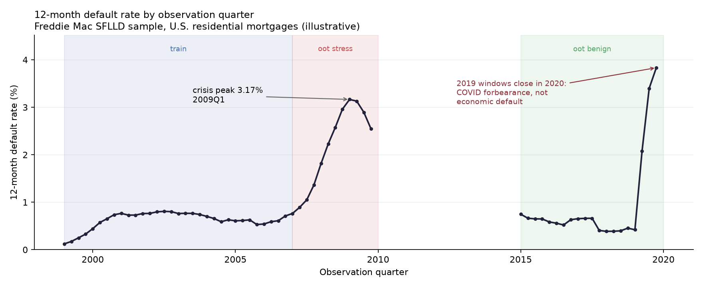

# Phase 2 — Panel, risk set, and labels

**Status: complete.** 3,442,585 panel rows · 54,728,617 risk-set rows · portfolio
default rate 0.868%.

> This is where the target variable gets defined and the experiment gets
> designed. Every metric you report later is a statement about choices made
> here. Get the label wrong and a beautiful AUC means nothing.

---

## 1. What this phase produces

Two matrices, built from the same event flags so they cannot disagree about what
a default is.

| Artifact | Grain | Rows | Feeds |
| --- | --- | --- | --- |
| **Panel** | one row per (loan, quarter-end) | 3,442,585 | 12-month PD models, Phases 3–4 |
| **Risk set** | one row per loan-month while alive | 54,728,617 | discrete-time hazard model, Phase 5 |

**Run it:** `make panel` (13 seconds)

---

## 2. The observation-cohort design

This is the part most portfolio projects get wrong, so be ready to explain it.

The naive approach is one row per loan: features at origination, label = "did it
ever default". That's wrong for three reasons — it can't express *when*, it
can't use time-varying information, and it can't produce a **12-month** PD,
which is what IFRS 9 Stage 1 actually requires.

The correct design instead asks, repeatedly:

> Stand at quarter-end *t*. Look at every loan that is alive and not already in
> default. Ask: **will it default in the next 12 months?**

```
        t = 2005-06-30                   window = next 12 months
        ─────┬──────────────────────────────────────────┬─────────
             │  features: everything known at or        │
             │  before t (origination + state at t)     │
             │                                          │
             └──────────────► label: default in here? ──┘
```

One loan therefore contributes **many rows**, one per quarter it survives. A
1999 loan alive through 2006 contributes ~32 rows, each with different state and
its own forward window.

Consequences worth stating out loud in an interview:

- **Rows are not independent.** The same borrower appears repeatedly. Standard
  errors that assume independence are too narrow — which is exactly why Phase 5
  clusters standard errors by calendar period.
- **Splits must be by loan, not by row.** Random row splitting puts the same
  borrower on both sides. That is the classic panel-data leak.

### Eligibility

A loan contributes a row at *t* only if it is alive, not already 90+ DPD, and
not yet terminated. The "not already in default" condition is essential: if the
loan were already 90+ DPD at *t*, the label would be implied by a feature, and
every metric downstream would be measuring nothing.

`tests/test_leakage.py` asserts this directly — **zero panel rows** are already
in default at their observation date.

### Censoring — the thing that separates a risk model from a classifier

What if the loan disappears mid-window?

| What happens in the window | Label | Why |
| --- | --- | --- |
| Defaults | **1** | Observed |
| Prepays (refinances, sells) | **0**, flagged | Observed — it didn't default. But it's *censored*: we stopped watching |
| Still reporting at window end | **0** | Observed |
| Data simply ends mid-window | **dropped** | **Not observed. Never imputed** |

That last row is the discipline. A loan whose 12-month outcome is not visible is
removed, never assumed to be a non-default. Assuming it would have survived
biases the default rate downward — you'd systematically under-provision.

Prepayment being labelled 0 *and flagged* matters too. Prepayment is not a good
outcome and not a bad one; it's the loss of the observation. It is a **competing
risk**, which Phase 5 models explicitly rather than ignoring.

---

## 3. The splits, and the cost of doing them properly

| Split | Window | Rows | Loans | Default rate |
| --- | --- | --- | --- | --- |
| train | 1999–2006 | 2,046,874 | 232,058 | **0.660%** |
| validation_in_time | 1999–2006 | 517,080 | 58,546 | **0.676%** |
| oot_stress | 2007–2009 | 342,603 | 42,133 | **2.173%** |
| oot_benign | 2015–2019 | 536,028 | 49,550 | **1.010%** |

Two things to read off this table:

**train ≈ validation_in_time (0.660% vs 0.676%).** Same period, disjoint loans.
They *should* agree, and a gap would mean the loan allocation is correlated with
risk. This is asserted in the test suite.

**oot_stress is 3.3× train.** That's the entire point. If it weren't materially
riskier, the out-of-time split wouldn't be testing regime change and every
stability conclusion downstream would be vacuous.

### Why loan-disjoint, and what it costs

The acceptance criterion is *no loan overlap across split boundaries*. Achieving
it means allocating each **loan** to exactly one split by seeded hash, then
taking only the observation dates inside that split's window.

The cost is real and worth being honest about: a loan allocated to `oot_stress`
contributes only its 2007–2009 rows — its 1999–2006 rows are **thrown away**.
That's why OOT splits are much smaller than a date-only partition would give.

The alternative — the same loan in train *and* in an out-of-time split — leaks
loan-level information across the boundary and makes OOT performance look better
than it is. **Recorded as finding F-003** rather than quietly accepted, with the
consequence (wider confidence intervals on OOT metrics) stated.

Note 2010–2014 belongs to no split. That's the build plan's design, not an
oversight; those rows are counted in the exclusions report and not written.

---

## 4. Leakage control as executable code

The rule: *at observation date t, a feature may use only information available
at or before t.*

Enforcing that by code review does not work. `conf/features.yaml` makes it data,
in three mutually exclusive sets:

| Set | Meaning | Size |
| --- | --- | --- |
| `observation_features` | Allowed. Origination + state at *t* | 30 |
| `forbidden` | **Must not appear in the matrix at all** | 20 |
| `label_and_metadata` | Must appear, never usable as an input | 7 |

The `forbidden` set is all outcome-side: `actual_loss`, `net_sales_proceeds`,
`mi_recoveries`, `total_expenses`, `zero_balance_code`, `delinquent_accrued_interest`.
Every one is measured **at or after** the credit event. Let one into training and
the model learns *"this loan has a disposition expense, therefore it defaulted"* —
AUC near 1.0 and completely worthless.

Three subtleties worth knowing:

**`termination_type` is forbidden even though we derived it ourselves.** It's not
a raw field, which makes it easy to overlook. It encodes exactly how the loan
ended.

**The forbidden fields must survive in `data/interim/`.** Phase 5 needs
`actual_loss` and the recovery components to estimate LGD empirically. Leakage
control is about what enters the *training matrix*, not about deleting data.
There's a test asserting this, specifically to stop someone "fixing" a leakage
failure by dropping columns at ingest.

**Some exclusions aren't leakage at all — they're availability.** `vantage_score`
is 100% null. `property_valuation_method` is 99.2% null (2017+ only).
`estimated_ltv` is 2017+ only *and* would embed future house prices. Each is
recorded with its reason so the decision is documented rather than rediscovered.

---

## 5. The finding: COVID forbearance (F-001)

The first plot showed the default rate hitting **3.83% at 2019Q4** — higher than
the 2009 crisis peak of 3.17%. In a "benign" split.

That is not credible, so it got investigated rather than shipped.

```
        2019   90+ DPD:  16,690 loan-months    3.9% forbearance-flagged
        2020   90+ DPD:  61,485 loan-months   75.0% forbearance-flagged
```

**The cause.** Under the CARES Act, borrowers entering COVID-19 payment
forbearance were permitted to stop paying. They register as 90+ DPD in the data
without an economic credit event. A 2019 observation date has a forward window
closing in 2020 — so the whole COVID forbearance wave lands inside `oot_benign`.

**54.9% of `oot_benign` defaults are forbearance-driven.** Strip them and the
rate is 0.458%, consistent with the surrounding quarters and genuinely benign.

### What was done — and what deliberately wasn't

The default definition was **not amended.** §7.1 forbids revising the target
after seeing results, and that rule exists precisely to stop you tuning the
label until the numbers look nice.

What happened instead:

1. A `default_in_forbearance` diagnostic column, derived from the borrower
   assistance status **in the month of first default** — exact, not inferred
   from date ranges.
2. It's in `label_and_metadata`, so it can never be used as a feature. It
   describes the outcome window, exactly like the label.
3. Every Phase 3/4 metric on `oot_benign` must be reported **twice**: as-is and
   excluding forbearance-driven defaults.
4. Recorded as **finding F-001, severity high**, and as assumption `PANEL_003`.
5. Annotated directly on the exhibit, so nobody reads the spike as real.

> **Restated 2026-08-30.** This section originally reported 60.1%, and non-zero
> forbearance counts in the pre-2014 splits — which is impossible, since the
> assistance field only exists from 2014. A code review traced it to DuckDB's
> `arg_min` ignoring null values, so the flag reached *forward* to a later
> month's code. Corrected figures: 54.9%, and exactly zero before 2014. Logged
> as **R-001**, and covered in [Phase 3](03-scorecard.md#7-what-a-code-review-caught).

**Why this is the best interview story in the project so far.** It shows a
suspicious number being chased rather than shipped, a distinction held between
*measurement* and *economic intent*, and the discipline not to quietly patch a
locked definition. That's what second-line review actually looks like.

---

## 6. The acceptance exhibit



| Period | Rate |
| --- | --- |
| 1999 start | 0.12% |
| 2002–2006 plateau | 0.53–0.81% |
| 2007Q4 | 1.36% |
| 2008Q4 | 2.96% |
| **2009Q1 peak** | **3.17%** |
| 2015–2018 | 0.37–0.75% |

Three details, each with a reason:

**The 1999–2000 ramp from 0.12% to 0.74% is seasoning, not a data error.** New
mortgages barely default in year one; borrowers have just been underwritten and
have not yet met adversity. The hazard peaks around years 3–5. This is why
Phase 5's hazard model has a loan-age baseline — the seasoning curve is the
point of the model.

**The line breaks at 2010–2014.** No split covers it, so drawing through the gap
would show a five-year trend that was never measured.

**The peak is 2009Q1, whereas Phase 1's *credit events* peaked in 2010–2012.**
Not a contradiction — the difference is exactly the foreclosure-to-disposition
lag. This panel labels from **delinquency at the observation date**, which is
when the borrower actually stopped paying. Labelling from termination date would
mis-date the crisis by three years.

---

## 7. Likely interview questions

**"How did you set up the training data?"**
> Observation-cohort panel. At each quarter-end from 1999 to 2019 I take every
> loan that's alive and not already 90+ DPD, and label whether it defaults in
> the next twelve months. One loan contributes many rows, so rows aren't
> independent and splits have to be by loan, not by row. 3.4 million rows,
> 0.87% default rate.

**"How do you handle loans that prepay?"**
> Labelled zero and flagged. Prepayment isn't a good outcome or a bad one, it's
> the loss of the observation — a competing risk. Phase 5 models it explicitly
> with a cause-specific hazard rather than treating it as a non-event. And if
> the outcome window isn't fully observable, the row is dropped, never imputed:
> assuming an unobserved loan survived biases the default rate down and you
> under-provision.

**"How do you prevent leakage?"**
> Three disjoint sets in config: allowed, forbidden, and label/metadata. The
> forbidden set is everything measured at or after the credit event — actual
> loss, recoveries, disposition expenses, the zero-balance code. Tests assert
> the forbidden set has empty intersection with both built matrices, plus a
> semantic test that no panel row is already in default at its observation date.
> There's also a test that the forbidden fields *still exist* in the interim
> tables, because Phase 5 needs them for LGD — leakage control is about the
> training matrix, not about deleting data.

**"Tell me about something that surprised you."** *(the F-001 story)*
> My benign out-of-time split showed a higher default rate than the 2008 crisis.
> That's not believable, so I dug in: 75% of 2020's 90+ DPD loan-months carry a
> COVID forbearance flag, against 3.9% in 2019. Borrowers were allowed to stop
> paying under the CARES Act — 90+ DPD on paper, no economic default. It hits
> the benign split because 2019 observation windows close in 2020. I did *not*
> change the default definition — that's locked before results by design.
> I added a diagnostic flag from the assistance status in the month of first
> default, required every metric on that split to be reported with and without
> it, and logged it as a high-severity finding.

**"Why is your out-of-time sample so much smaller than training?"**
> Because splits are loan-disjoint. A loan allocated to the stress split
> contributes only its 2007–2009 rows; its earlier rows are discarded. That's
> the cost of not leaking loan-level information across the boundary. It means
> wider confidence intervals on OOT metrics, which is why reliability curves
> carry binomial intervals. It's logged as finding F-003.

---

## 8. What's carried forward

- **F-001** — every `oot_benign` metric reported with and without forbearance
- **F-002** — quantify code 15's incremental contribution to the label
- **F-003** — OOT confidence intervals must be shown, not assumed
- Rows aren't independent → Phase 5 clusters standard errors by period
- The seasoning curve is real → Phase 5's hazard baseline must capture it

---

**Next:** Phase 3 — binning, WOE, and the scorecard champion. The `metrics/`
module is already built and tested; Phase 3 puts a model in front of it.
