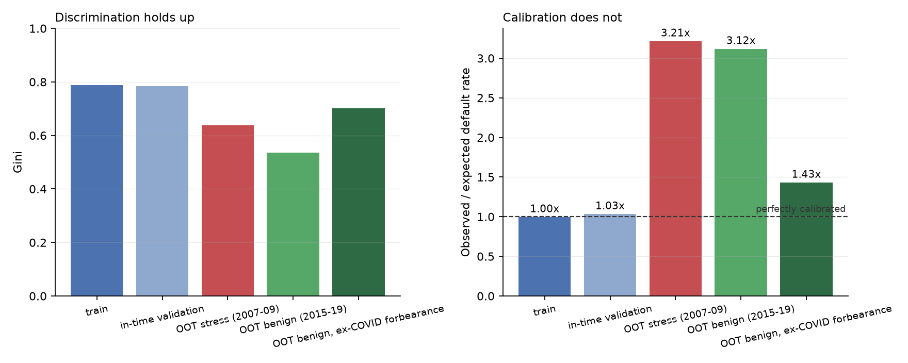
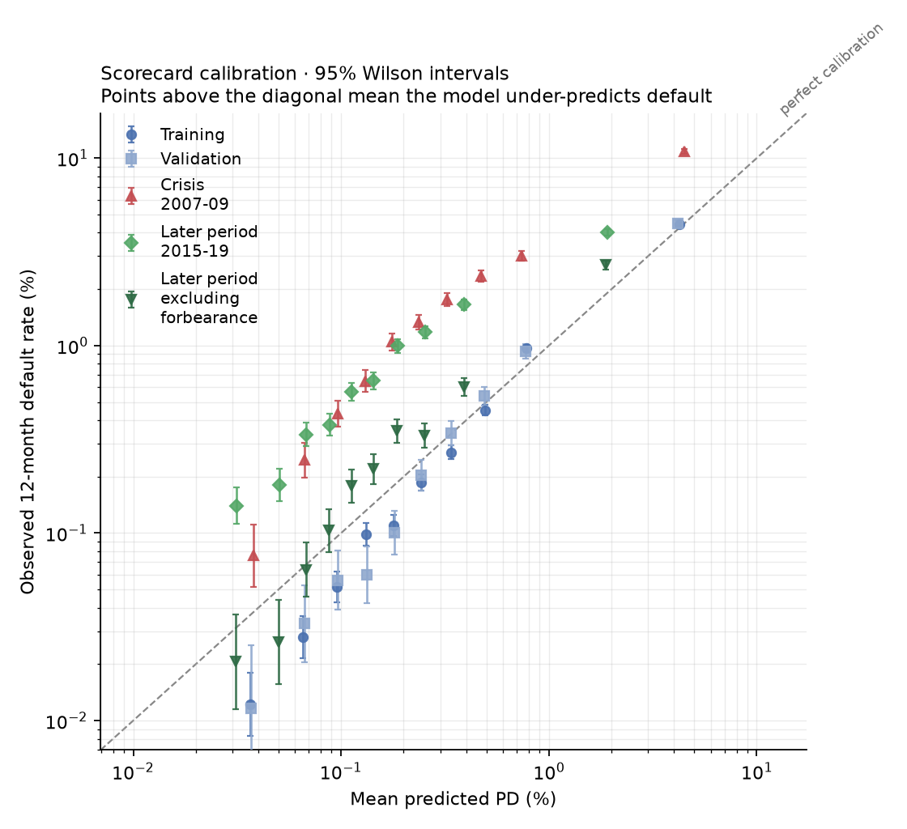

# Phase 3 — The WOE scorecard champion

> Detailed reference. Start with the [demo](../README.md); use the
> [reference index](README.md) to find a specific topic.

**Implemented:** 15 features · AUC 0.894 train / 0.819 OOT-stress · **and the
headline finding.**

> This phase produces the project's central result: **discrimination held up and
> calibration collapsed.** A model that keeps 81% of its ranking power while
> under-predicting default by 3.2× is a good classifier and a bad risk model.
> That distinction is the entire point.

**Run it:** `make train` (~30 seconds)

---

## 1. What a scorecard is, and why it's the champion candidate

A scorecard is logistic regression with two extra steps: bin each feature, then
replace the bin with its **Weight of Evidence** before fitting.

```
WOE_i = ln( (good_i / good_total) / (bad_i / bad_total) )
IV    = Σ (good_i/good_total − bad_i/bad_total) × WOE_i
```

"Good" = non-default, so **higher WOE means lower risk**. Every fitted
coefficient should therefore be **negative** — a fact worth stating once and
then testing, because it's the cheapest conceptual-soundness check available.

This is the industry default for credit, not nostalgia. Four properties a raw
GBM doesn't give you:

| Property | Why it matters |
| --- | --- |
| **Monotonicity by constraint** | Higher LTV *cannot* produce lower risk. Enforced in the fit, not hoped for |
| **Missing is a bin** | 8% of loans have no DTI. That absence is informative, and never imputed |
| **Exact explanations** | Points sum to the score with zero residual. No post-hoc approximation |
| **A human can read it** | "This borrower lost 34 points for LTV" is defensible to an adjudicator |

Scaling uses the standard formulation, with **PDO = 20, base score 600, base
odds 50:1**:

```
factor = PDO / ln(2) = 28.8539
offset = base_score − factor × ln(base_odds) = 487.12
score  = offset + factor × (−log_odds)          # higher = safer
```

The defining property — 20 points doubles the odds — is asserted in the tests
against a hand-computed value.

---

## 2. Four things the data forced me to fix

Feature selection is where most of the real work happened. Each of these was
caught by a guard, investigated, and resolved with a written reason.

### 2.1 The most predictive feature was silently discarded

`current_loan_delinquency_status` came back with **IV = 0.0000 and one bin.**
For the feature describing whether a borrower is *currently behind on payments*,
that's absurd.

```
status 00 (current)      2,021,101 rows (98.74%)   default rate  0.40%
status 01 (30-59 DPD)       22,521 rows ( 1.10%)   default rate 16.20%   ← 40×
status 02 (60-89 DPD)        3,252 rows ( 0.16%)   default rate 57.47%   ← 143×
```

**Cause:** the global `min_bin_size: 0.02` (2%). Levels 01 and 02 together are
1.26% of rows, so optbinning legally collapsed all three into one bin and
reported zero information.

**Fix:** a per-feature override to 0.05%, with a written rationale. The 2% rule
is a heuristic for the thin tails of *continuous* features; here the levels are
a small ordered categorical with 22,521 and 3,252 training observations — ample
for a stable WOE. Config **rejects an override that has no rationale**.

**The general lesson:** a sensible default silently destroyed the best feature
in the dataset. Guards protect you from noise and from signal equally.

### 2.2 Two features were the same column

`current_interest_rate` and `original_interest_rate` are **identical on 100.00%
of training rows** (correlation 0.999976). The book is fixed-rate and
effectively unmodified over 1999–2006, so the current rate *is* the origination
rate.

Both would split one effect across two arbitrary coefficients. Dropped one,
recorded the evidence in `known_duplicates`.

Broader collinearity pruning uses a **0.95 ceiling on the WOE matrix**, keeping
the higher-IV member of any pair — which also removed
`remaining_months_to_legal_maturity` (r = 0.959 with `original_loan_term`).

This matters far more for a scorecard than a GBM: collinearity inflates
coefficient standard errors and destabilises the points, destroying the one
thing a scorecard exists to provide.

### 2.3 The leakage tripwire fired twice — and I did not move it

An IV ceiling of 0.9 flags "suspiciously strong" features, because an
enormously predictive single variable is usually leakage. Two tripped it.

**`credit_score`, IV 1.1543.** Investigated:

```
<620    3.137%      700-739   0.415%
620-659 2.035%      740-779   0.158%
660-699 0.909%      780+      0.092%
```

A 34× spread, monotone throughout, on 2.0M rows. FICO is *constructed* to
rank-order default. **Verdict: genuine.**

**`current_loan_delinquency_status`, IV 1.6840.** Also genuine — it's
contemporaneous information known at *t*, and eligibility already excludes loans
at 90+ DPD, so these are loans 30–89 days late that haven't defaulted.

**The design decision that matters here.** My first instinct was to raise the
ceiling to 1.5, then to 1.7. That's the trap: *raise a threshold until nothing
fires and you've converted a control into decoration.* Instead the ceiling
stayed at 0.9 and each catch is cleared individually in an `iv_cleared` list
with written evidence. There's a test asserting the ceiling is still 0.9 and
that every cleared entry carries evidence.

### 2.4 Two coefficients came back the wrong sign

`first_time_homebuyer_flag` (+0.0516) and `loan_purpose` (+0.0127) fitted
*positive* — meaning the multivariate fit reversed the direction their own
binning established. On a scorecard that's not a curiosity: it produces a bin
that **awards more points for worse credit**, which cannot be defended.

Both were weak (IV 0.024 and 0.020, barely over the floor), so the reversal is
residual collinearity, not a real effect. They're eliminated **iteratively,
worst first** — standard scorecard practice, because dropping the worst offender
often restores the others. Final model: **15 features, all negative.**

---

## 3. The headline result

| Split | n | AUC | Gini | KS | Observed | Predicted | **O/E** |
| --- | --- | --- | --- | --- | --- | --- | --- |
| train | 2,046,874 | 0.894 | 0.787 | 0.622 | 0.660% | 0.662% | **1.00** |
| in-time validation | 517,080 | 0.892 | 0.784 | 0.611 | 0.676% | 0.654% | **1.03** |
| OOT stress (2007–09) | 342,603 | 0.819 | 0.638 | 0.460 | 2.173% | 0.676% | **3.21** |
| OOT benign (2015–19) | 536,028 | 0.768 | 0.535 | 0.388 | 1.010% | 0.324% | **3.12** |
| OOT benign, ex-forbearance | 533,056 | 0.851 | 0.701 | 0.526 | 0.458% | 0.320% | **1.43** |



**Read the two panels together. That is the finding.**

- **Discrimination degrades gracefully.** Gini 0.787 → 0.638 in the crisis. The
  model still retains **81%** of its ranking power. It still knows *who* is
  riskier.
- **Calibration collapses.** O/E 1.00 → **3.21**. The model predicts 0.68%
  where **2.17%** actually happened. It has no idea *how much* risk there is.

### Why this is the thing that matters

ECL is a **money** number: `PD × LGD × EAD`. A PD understated by 3.2× understates
the provision by roughly 3.2× before any macro overlay. On a $300B book that is
not a modelling curiosity, it's a material misstatement.

**And a model selected on AUC would have passed.** AUC 0.819 in the crisis looks
respectable. Nothing in the discrimination metrics tells you the provision is a
third of what it should be. Recorded as **finding F-005, severity high.**

The mechanism is straightforward: the model is fitted on 1999–2006, when the
portfolio default rate was ~0.66%. It learned that *level*. Discrimination is a
statement about ranking, which is regime-invariant; calibration is a statement
about level, which is not. This is precisely the gap the Phase 5 macro overlay
exists to close.

---

## 4. The reliability curve



Log-log, because predicted PDs span 0.01% to 11% and a linear axis crushes
everything below 1% into the corner — which is exactly where most of the
portfolio sits.

- **Train and in-time validation sit on the diagonal.** Well calibrated.
- **OOT-stress sits consistently above it.** Under-predicting in every band, not
  just on average — this is systematic, not noise.
- **OOT-benign as-is is also above** — but the **ex-forbearance series pulls back
  toward the line.**

Intervals are **Wilson**, not normal-approximation. Default rates are small and
the safest deciles hold few defaults, exactly where a normal interval goes
negative and understates uncertainty.

### F-001 vindicated

| oot_benign | AUC | Gini | O/E |
| --- | --- | --- | --- |
| as-is | 0.768 | 0.535 | 3.12 |
| ex-COVID forbearance | **0.851** | **0.701** | **1.43** |

Without the Phase 2 forbearance work, the conclusion would have been *"the model
degrades badly even in benign conditions"* — **which is false.** It was almost
entirely a CARES Act artifact. Corrected, 2015–19 shows mild over-optimism
(1.43×), not collapse.

This is the payoff for chasing a suspicious number instead of shipping it.

---

## 5. Questions a reviewer would ask

**"Walk me through your model."**
> WOE scorecard — logistic regression on optimally binned features. 27
> candidates, 18 pass an IV floor of 0.02, 17 survive collinearity pruning at
> r=0.95, 15 after eliminating wrong-sign coefficients. Monotone constraints
> where the economics are known: higher LTV can't produce lower risk. AUC 0.894
> in-sample, 0.819 out-of-time through the crisis.

**"Why a scorecard and not gradient boosting?"**
> Three reasons, and the third is the real one. Monotonicity is a constraint I
> can impose rather than hope for. Missing values become their own bin instead
> of being imputed. And the explanation is exact — points sum to the score with
> zero residual, which SHAP can't offer for a GBM. Phase 4 fits the GBM as a
> challenger and compares them on a recorded comparison rubric.

**"What's the most important thing you found?"** *(F-005)*
> That discrimination and calibration degrade at completely different rates.
> Through the crisis Gini only fell from 0.79 to 0.64 — it kept 81% of its
> ranking power. But observed-over-expected went from 1.00 to 3.21: it predicted
> 0.68% when 2.17% happened. Since ECL is PD × LGD × EAD, that understates the
> provision threefold. A model selected on AUC would have passed. That's why the
> selection rubric weights calibration and stability, not just discrimination.

**"Your best feature had an IV of 1.68. Isn't that leakage?"**
> That was my first thought, which is why there's a tripwire at 0.9. It's
> delinquency status at the observation date. It's legitimate — eligibility
> already excludes loans at 90+ DPD, so these are loans 30–89 days late that
> haven't defaulted, and no forward information is used. But it *is*
> mechanically close to the target: a loan at 60–89 DPD needs one more missed
> payment to meet the definition. F-004 records this limitation. The
> [ablation study](../reports/delinquency_ablation.md) refits both families without
> delinquency; other behavioural covariates remain, so it does not isolate
> origination credit quality. What I didn't do was raise the threshold until it stopped
> firing — the ceiling is still 0.9 and each exception is cleared individually
> with written evidence.

**"You had features with the wrong sign. What did you do?"**
> Dropped them iteratively, worst first. A positive coefficient on a WOE feature
> means the multivariate fit reversed the direction its own binning established,
> which produces a bin awarding more points for worse credit. Both were weak
> features just over the IV floor, so it was residual collinearity rather than a
> real effect. There's a test that fails the build if any surviving coefficient
> is positive.

**"How do you know your bins are monotone?"**
> optbinning is *asked* for monotonicity — I check it was delivered. There's a
> separate report verifying each declared constraint actually holds in the
> fitted bins, and a test that fails if any doesn't. A constraint that silently
> failed to bind would put a non-monotone feature on a scorecard that claims to
> be monotone.

---

## 6. What a code review caught

Four defects, found by review after the phase was "complete". Worth studying —
they are all the kind that pass tests, lint, and strict type checking.

### R-001 (high) — a look-ahead hiding in SQL null semantics

The COVID forbearance flag was derived with:

```sql
arg_min(borrower_assistance_status_code, period) FILTER (WHERE is_default)
```

**DuckDB's `arg_min` ignores rows whose ranked value is null.** So when the first
default month carried no assistance code, it silently skipped forward and
returned a **later** month's code.

A look-ahead — precisely what the whole §7.3 leakage apparatus exists to prevent
— and the leakage tests couldn't catch it, because it lived in a *diagnostic*
column rather than a feature.

Consequences: 1,600 loans falsely flagged; F-001's share overstated at 60.1%
against a true 54.9%; the OOT-benign sensitivity over-corrected to 1.27 when the
true figure is 1.43.

**The signal I should have caught myself.** The original output showed 103
forbearance defaults in `train` and 163 in `oot_stress`. Those splits are
1999–2009. The assistance field **did not exist before January 2014.** A
structurally impossible number was sitting in my own output table and I read
past it.

Fix: wrap the ranked value in a struct, which is never null, so the earliest
default row always wins. There is now a test asserting the pre-2014 splits carry
**exactly zero** forbearance flags.

> **Lesson worth carrying:** aggregate functions have null semantics that can
> constitute look-ahead. And a structurally impossible value — a 2005 loan
> flagged with a field introduced in 2014 — is the cheapest error signal you
> will ever get. Read your own tables.

### R-002 (medium) — CSI was blind to missingness

Numeric CSI dropped nulls from both sides before binning; categorical CSI left
them out of the levels *and* the denominator. A feature going from **50% missing
to 0% missing returned CSI = 0.0.**

That directly contradicts the project's own stated principle that a meaningful
absence is information — and it would have hidden one of the most common causes
of silent model failure in production: a data feed that starts or stops
populating a field. Both paths now carry an explicit `__missing__` bin, verified
to still return exactly 0.0 for a feature against itself.

### R-003 (medium) — explanations depended on who else was in the batch

`principal_drivers` centred contributions on the mean of *the batch supplied to
it*. A borrower scored alone got **every driver reported as 0.0**, and the same
borrower got a different explanation alongside different peers.

This is the Phase 6 API path — `/score` receives one loan. An explanation that
varies with the rest of the request is not an explanation of the borrower, and
could not be defended to an adjudicator. Now centred on the **training**
population mean, captured at fit time and stored with the model.

### R-004 (low) — `--verbose` and `--json-logs` did nothing

Three compounding layers: logging configured at import before flags were parsed;
a configure-once guard discarding the later call; structlog's logger caching
binding module loggers to the import-time config. Then a fourth found while
fixing it — `get_logger` re-applied the *defaults* on every call, reverting the
explicit choice. All four fixed; both flags verified end to end.

### Why this section exists

A validation report that only contains findings against the *model* is not
credible. These are findings against the *engineering*, found by review, recorded
with the same severity discipline, and fixed with regression tests that fail
against the original code. **R-001 changed reported numbers**, so every affected
figure was restated across the findings register, the assumptions register, and
these documents.

---

## 7. What's carried forward

- **F-005 (high)** — the calibration gap. Phase 4 tries isotonic and Platt;
  Phase 5's macro overlay is the real remediation. Expect it to reduce, not
  eliminate.
- **F-004 (medium)** — the [delinquency ablation](../reports/delinquency_ablation.md) now reports both variants; interpretation remains limited.
- **F-001** — every benign-split metric now reported twice, permanently.
- Phase 4 must compare **calibrated and uncalibrated** for both models on both
  OOT splits, with recorded rubric weights.

---

**Next:** Phase 4 — the LightGBM challenger, calibration, SHAP, and the
selection memo. The expectation to test: the GBM wins on AUC and loses on
reliability under regime change.
