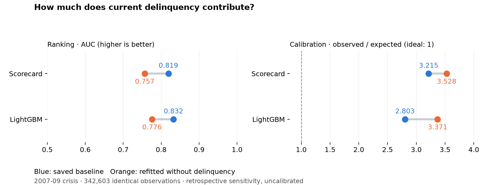

# Delinquency ablation

Retrospective sensitivity study on the existing evaluation splits. It is not a fresh holdout or a causal estimate of delinquency's effect.

## Crisis period: all observations

| Model | Variant | Rows | AUC | Observed / expected |
| --- | --- | --- | --- | --- |
| scorecard | with_delinquency | 342,603 | 0.8191 | 3.215 |
| lightgbm | with_delinquency | 342,603 | 0.8324 | 2.803 |
| scorecard | without_delinquency | 342,603 | 0.7567 | 3.528 |
| lightgbm | without_delinquency | 342,603 | 0.7758 | 3.371 |

## Crisis period: current loans only

| Model | Variant | Rows | AUC | Observed / expected |
| --- | --- | --- | --- | --- |
| scorecard | with_delinquency | 336,602 | 0.7394 | 4.030 |
| lightgbm | with_delinquency | 336,602 | 0.7585 | 3.938 |
| scorecard | without_delinquency | 336,602 | 0.7386 | 2.483 |
| lightgbm | without_delinquency | 336,602 | 0.7603 | 2.384 |

## Interpretation

Removing delinquency reduces whole-crisis ranking performance for both families. The current-only cohort separates ranking within performing loans from ranking across delinquency states. Both variants still under-predict crisis defaults. Other behavioural covariates remain; this is not an origination-only experiment.

## Method and reproduction

Baselines are reloaded fitted bundles. The scorecard variant reuses the same training-only univariate bins and repeats feature selection and coefficient fitting without current delinquency. The LightGBM variant repeats the configured grid and validation early stopping without that feature. All metrics are uncalibrated. The same observations are used for each paired comparison; other splits and 30-60 DPD cohorts are in the CSV.

Run `make ablate` with the licensed panel and saved baseline bundles, then `make report`. This writes separate study outputs and does not replace the main models.

[All results](figures/delinquency_ablation.csv) · [Run protocol, input hashes, fitted features, and grid](figures/delinquency_ablation_manifest.json) · [Implementation](../src/riskos/models/ablation.py)
